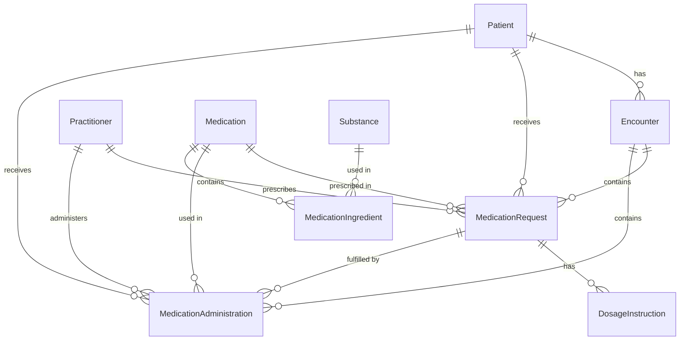

# EHR Database ER Diagram

## Entity-Relationship Diagram

## Database Schema

### Patient
- id (PK)
- name
- birthDate
- gender
- address
- contact

### Practitioner
- id (PK)
- name
- qualification
- specialty

### Encounter
- id (PK)
- status
- period_start
- period_end
- patientId (FK -> Patient.id)
- type

### Substance
- id (PK)
- code
- system
- display

### Medication
- id (PK)
- code
- system
- display
- form
- form_code
- form_system
- manufacturer
- lot_number
- expiration_date

### MedicationIngredient
- id (PK)
- medicationId (FK -> Medication.id)
- substanceId (FK -> Substance.id)
- strength_numerator_value
- strength_numerator_unit
- strength_numerator_system
- strength_denominator_value
- strength_denominator_unit
- strength_denominator_system

### MedicationRequest
- id (PK)
- status
- intent
- authoredOn
- patientId (FK -> Patient.id)
- practitionerId (FK -> Practitioner.id)
- medicationId (FK -> Medication.id)
- encounterId (FK -> Encounter.id)
- reasonCode
- reasonDisplay
- note

### DosageInstruction
- id (PK)
- requestId (FK -> MedicationRequest.id)
- sequence
- text
- addInstruction
- timing
- route
- route_code
- route_system
- method
- method_code
- method_system
- doseQuantity
- doseUnit

### MedicationAdministration
- id (PK)
- status
- effectiveDateTime
- patientId (FK -> Patient.id)
- medicationId (FK -> Medication.id)
- requestId (FK -> MedicationRequest.id)
- encounterId (FK -> Encounter.id)
- practitionerId (FK -> Practitioner.id)
- dosageRoute
- dosageRoute_code
- dosageRoute_system
- dosageMethod
- dosageMethod_code
- dosageMethod_system
- dosageQuantity
- dosageUnit

## Relationships

1. A **Patient** can have multiple **Encounters**, **MedicationRequests**, and **MedicationAdministrations**.
2. A **Practitioner** can create multiple **MedicationRequests** and perform multiple **MedicationAdministrations**.
3. An **Encounter** can include multiple **MedicationRequests** and **MedicationAdministrations**.
4. A **Medication** can be prescribed in multiple **MedicationRequests** and used in multiple **MedicationAdministrations**.
5. A **Medication** contains one or more **MedicationIngredients**.
6. A **Substance** can be used in multiple **MedicationIngredients**.
7. A **MedicationRequest** can have multiple **DosageInstructions** and can be fulfilled by multiple **MedicationAdministrations**.

## Data Sources

- **Patient**, **Practitioner**, and **Encounter** data comes from various FHIR resources in the EHR system.
- **Medication** data comes from `medication.json` FHIR resource.
- **MedicationRequest** data comes from `medication_request.json` FHIR resource.
- **MedicationAdministration** data comes from `medication_administration.json` FHIR resource.
- **Substance** and **MedicationIngredient** data is derived from the ingredients section in `medication.json`.
- **DosageInstruction** data comes from the dosageInstruction section in `medication_request.json`.